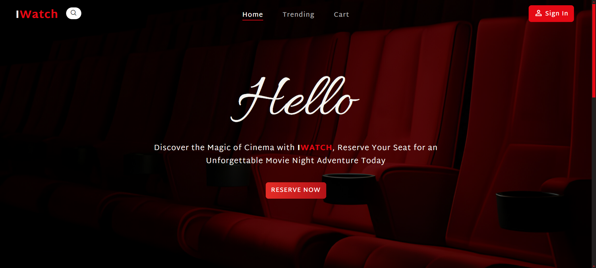
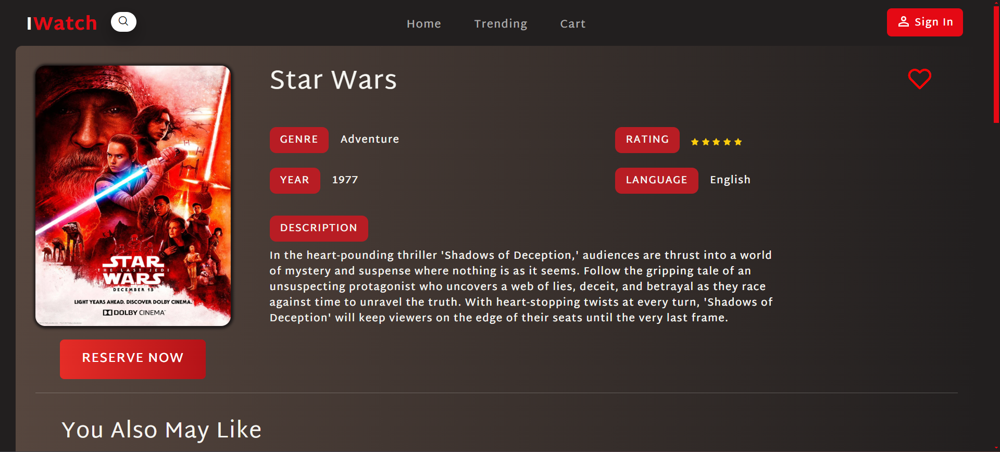
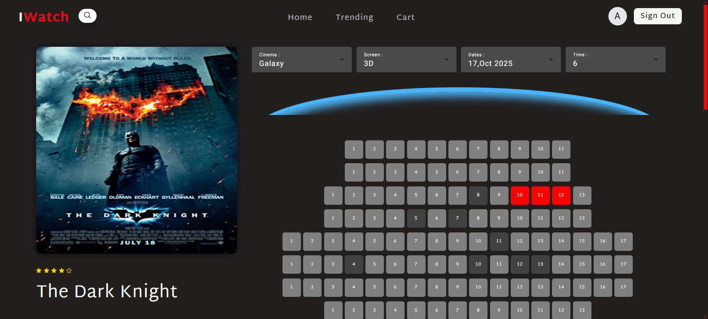

<div id="top"></div>

<!-- PROJECT SHIELDS -->


<!-- PROJECT LOGO -->
</br>
<div align="center">
      <a href="https://react-ui-colors.vercel.app/">
       
      </a>
</div>

<!-- TABLE OF CONTENTS -->
<details>
  <summary>Table of Contents</summary>
  <ol>
    <li>
      <a href="#about-the-project">About The Project</a>
      <ul>
      <li><a href="#built-with">Built With</a></li>
      <li><a href="#features">Features</a></li>
      </ul>
    </li>
    <li>
      <a href="#getting-started">Getting Started</a>
      <ul>
        <li><a href="#installation">Installation</a></li>
      </ul>
    </li>
    <li><a href="#contributing">Contributing</a></li>
  </ol>
</details>

<!-- ABOUT THE PROJECT -->

## About The Project

I-WATCH is a site for reserving cinema seats and includes modern and old films and the site is characterized by its ease of use and the ability to book tickets and pay for them through the site.





### Built With

- Angular
- Typescript
- Node js
- Express js
- MongoDB
- PrimNG
- Bootstrap
- JWT
- Paypal

### Features

- Authentication & Authorization (JWT)
- Reserving Seats
- Searching for Movies
- Filtering Movies
- Add reviews
- Payment (Paypal)
- Dashboard
- Responsive Design

<p align="right">(<a href="#top">back to top</a>)</p>

---

## Getting Started

This project require some perquisites and dependencies to be installed, you can find the instructions below:

### Installation

> To get a local copy, follow these simple steps :

#### Backend

1. Clone the repo

   ```sh
   git clone https://github.com/merna-desouky/ITI-angular-project.git
   ```

2. go to server folder

   ```sh
   cd ITI-angular-project/Backend
   ```

3. install dependencies

   ```bash
   npm install
   ```

4. Run development server

   ```sh
    node server.js
   ```

#### Frontend

1. go to client folder

   ```sh
   cd ITI-angular-project/Frontend
   ```

2. install dependencies

   ```bash
   npm install
   ```

3. Run development server

   ```sh
   ng serve -o
   ```

<p align="right">(<a href="#top">back to top</a>)</p>

---

<!-- CONTRIBUTING -->

## Contributing

Contributions are always welcome!

If you have a suggestion that would make this better, please fork the repo and create a pull request. You can also simply open an issue with the tag "enhancement".
Don't forget to give the project a star! Thanks again!

1. Fork the Project
2. Create your Feature Branch (`git checkout -b feature/AmazingFeature`)
3. Commit your Changes (`git commit -m 'Add some AmazingFeature'`)
4. Push to the Branch (`git push origin feature/AmazingFeature`)
5. Open a Pull Request

<p align="right">(<a href="#top">back to top</a>)</p>

<!-- ACKNOWLEDGMENTS -->

## Acknowledgments

- [Ahmed](https://github.com/ahmedalam98)
- [Aml](https://github.com/AmlMahdawy)
- [Merna](https://github.com/merna-desouky)
- [Mostafa](https://github.com/mostafataha177)
- [Omar](https://github.com/OmarAbd-Almaksoud)
